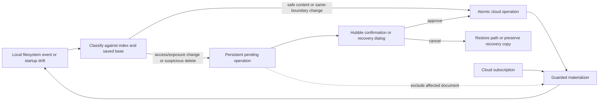

# Desktop cloud workspace

> **Architecture snapshot:** revalidated on `v1-release` at
> [`2f3fb6f`](https://github.com/bholmesdev/hubble.md/tree/2f3fb6f)
> on 2026-07-13 after the second flag-gated Phase 5 unified-shell slice.
> The product contract is durable; re-run the gate after material architectural changes.

## Context

The desired behavior is defined by [PRODUCT.md](./PRODUCT.md). Desktop should show one
cloud context and one folder/document tree while exposing watched Markdown as a safe,
writable local interface—not as a second authority or navigation tree.

At the pinned commit, the implementation still reflects the superseded dual model:

- [`apps/desktop/src/components/Sidebar.tsx`](https://github.com/adrianricardo/hubble.md/blob/3b437d3b6ab6fdcb82498bc021118f1417806b60/apps/desktop/src/components/Sidebar.tsx#L43)
  composes a cloud folder section, a root **Live Documents** section, and a separate
  local filesystem tree.
- [`packages/cloud-ui/src/SidebarSections.tsx`](https://github.com/adrianricardo/hubble.md/blob/3b437d3b6ab6fdcb82498bc021118f1417806b60/packages/cloud-ui/src/SidebarSections.tsx#L25)
  renders folders and root documents as separate components.
- [`SyncedFolderService.connect`](https://github.com/adrianricardo/hubble.md/blob/3b437d3b6ab6fdcb82498bc021118f1417806b60/apps/desktop/electron/syncedFolderService.ts#L217)
  replays only already-queued watcher events, then materializes cloud content before
  starting the watcher. An edit made while Hubble was fully quit was never queued.
- Both the
  [workspace materializer](https://github.com/adrianricardo/hubble.md/blob/3b437d3b6ab6fdcb82498bc021118f1417806b60/packages/sync/src/sync.ts#L484)
  and the
  [folder-mount materializer](https://github.com/adrianricardo/hubble.md/blob/3b437d3b6ab6fdcb82498bc021118f1417806b60/packages/sync/src/sync.ts#L684)
  overwrite differing local bytes without first classifying startup drift.
- A local move immediately composes cloud move and rename mutations, while an expired
  unlink immediately soft-deletes the cloud document
  ([`syncedFolderService.ts`](https://github.com/adrianricardo/hubble.md/blob/3b437d3b6ab6fdcb82498bc021118f1417806b60/apps/desktop/electron/syncedFolderService.ts#L615)).
- Local create calls member-only `documents.importMarkdown`, then moves the document.
  Folder editor guests therefore cannot create through a projection, even though
  `documents.create` already permits them
  ([`documents.ts`](https://github.com/adrianricardo/hubble.md/blob/3b437d3b6ab6fdcb82498bc021118f1417806b60/packages/sync-backend/convex/documents.ts#L1770)).
- Repo mounts are stored and run independently by folder ID, but overlap is not
  rejected, events are not mount-scoped, and each mount subscribes to the global
  workspace change feed.
- `CONTEXT.md`, ADR-0009, and `specs/realtime-collab/SYNCED-FOLDER.md` still describe
  local-authority product modes or immediate local-delete semantics. They require an
  explicit supersession pass when implementation begins.

### Revalidation gate

Before changing code, the implementing agent must run:

```sh
git diff --stat 3b437d3b6ab6fdcb82498bc021118f1417806b60...HEAD -- \
  apps/desktop apps/www packages/cloud-ui packages/ui packages/sync \
  packages/convex-client packages/sync-backend packages/cli \
  CONTEXT.md docs/adr specs/realtime-collab
```

The agent must then re-read every changed boundary named below and update this TECH.md
before implementation. Re-reading code is required to map the current architecture; it
does not replace PRODUCT.md, which remains the normative statement of intent.

**2026-07-11 result:** completed against `8f2fb06`. Since the original pin, changed
boundaries add CLI-driven desktop install/auth handoff and allow repo-link selection
from a child directory while resolving the git root. Repo mounts are still owned by
the `repoMounts` map in Electron `main.ts`; `SyncedFolderService` is still the per-root
engine; desktop still composes `FoldersSection`, `LiveDocumentsSection`, and the local
tree; subscriptions remain workspace-global. No projection manager, startup disk scan,
pending-operation journal, unified cloud tree, or folder-scoped subscription contract
has landed. The module ownership table and phase ordering below therefore remain
current. The naming prerequisite is now closed: `document.path` supplies the canonical
filename (title fallback for legacy pathless documents), and watcher classification
waits for materialize indexing/self-write hashes.

**2026-07-13 result:** re-run against `51f0ee9`. Phase 2 startup drift, guarded
materialization, the versioned operations journal, explicit topology, atomic
relocation review, deletion classification, Trash/Undo, and collision-safe restore
are now implemented and independently accepted in isolated Electron. The per-root
engine is still `SyncedFolderService`; the whole-workspace instance and repo-mount map
remain composed directly in Electron `main.ts`, and renderer review APIs still route
only to the whole-workspace instance. Cloud subscriptions remain workspace-global,
`packages/cli` still lacks projection status, and the desktop still renders the three
legacy content sections. The ownership table remains current. Phase 4 now starts with
a testable mount-validation seam; a projection manager is still required to own
aggregate lifecycle, operations, and status before the unified UI lands.

**2026-07-13 Phase 4 result:** re-run against `0882b75`. The projection manager now
owns whole-workspace and folder-engine lifecycle, status, managed-path lookup, and
operation routing. Every renderer event and agent-facing status record carries local
root, Workspace, and folder identity (the legacy multi-Workspace mirror necessarily
uses null cloud IDs). Repo mounts subscribe only to their authorized folder-subtree
query instead of every accessible Workspace/shared root. The desktop socket exposes
bounded operation counts, and `hubble status --json` reports per-root health, queued
edits, pending review, recovery, and Undo availability without document content or
credentials. Phase 4 is complete at code/test/build level; Phase 5 unified desktop
context/tree work is next.

**2026-07-13 Phase 5 result:** re-run against `05fd66e`. The renderer still composes
the legacy cloud and local sections, while the backend already provides both member
Workspace metadata and a guest-safe shared-folder subtree. No new backend contract is
needed for the first unified-navigation slice. Persisted renderer state still stores
only `selectedSpaceId`, and there is no internal unified-tree flag, context union, or
cloud-ID tree component. The existing `ProjectionManager` and `listRepoMounts` API are
the current local-availability join boundary; do not infer device state from folder
repo metadata.

**2026-07-13 Phase 5 controls revalidation:** re-run against `2f3fb6f`. The unified
tree and scoped mount-status join are present behind the internal flag. Existing
`listRepoMounts` remains the renderer boundary for local availability, while mount
lifecycle mutations remain in `apps/desktop/electron/main.ts` behind typed preload
IPC. Contextual reveal/copy can stay renderer-local; relocate and stop-local require
explicit lifecycle APIs so cleanliness, engine ownership, overlap validation, config
updates, and filesystem changes remain main-process responsibilities. Existing
`folders.list` and `sync.listWorkspaceMembers` queries are sufficient for the
multi-member create destination prompt; no backend contract change is required.

**2026-07-13 Phase 6 import revalidation:** re-run against current `v1-release`
after Phase 5 flag removal. Local file associations still enter through
`App.tsx`'s `openLocalPath`, while the cloud shell intentionally hides its local
file picker. The remaining import seam is `importLiveDocuments` →
`SyncBackend.importLiveDocument` → `documents.importMarkdown`; it targets only a
Workspace root, requires membership, and updates an existing live document on a
path match. Phase 6 therefore starts by making this contract folder-authorized,
idempotency-keyed, and collision-preserving. Electron remains responsible for
source deletion: a move may complete only after the owning projection engine has
refreshed and its document-ID index plus on-disk bytes match the imported content.

### Architecture principles

1. Cloud document identity is authoritative; a path is mutable presentation metadata.
2. No cloud-to-disk write may occur until local drift has been classified and protected.
3. Safe operations are automatic; unsafe or authorization-changing operations become
   durable pending operations.
4. Access impact is calculated and revalidated server-side in the same transactional
   boundary that authorizes the move.
5. One document has at most one managed local copy per device in v1.
6. Every event, status, and recovery item is scoped to a specific local root and cloud
   folder so multiple mounts cannot become ambiguous.

## Affected apps and packages

| Area | Responsibility |
| --- | --- |
| `apps/desktop` | Unified context/tree shell, confirmation and recovery UI, Electron projection coordination, notifications, mount registry, IPC, and removal of public local-authority entry points. |
| `packages/cloud-ui` | Cloud-ID-based folder/document tree, shared-root navigation, creation controls, search scope, and access-boundary presentation reusable by desktop without forcing cloud nodes through filesystem paths. |
| `packages/ui` | Reuse the existing `Modal`, tree/menu primitives, buttons, and accessible focus patterns. Extend only if the desktop review cannot be expressed with existing primitives. |
| `packages/sync` | Pure projection planning, startup drift classification, guarded materialization, index versioning, recovery-safe filesystem operations, and backend contracts. |
| `packages/sync-backend` | Guest-safe idempotent creation, metadata-only shared roots, access-impact calculation, atomic relocation, Trash/restore, and permission enforcement. |
| `packages/convex-client` | Typed adapters plus folder-scoped subscriptions for the new backend contracts. |
| `packages/cli` | Machine-readable desktop/local-root status so agents can detect queued, pending-review, offline, or error states. |
| `apps/www` | No planned IA change. Existing shared-folder/web routes must continue to work against any evolved backend contracts. |

`packages/editor` should not need changes. Markdown serialization remains a prerequisite
for lossless projection behavior but is not owned by this feature.

## End-to-end flow



## Module architecture

### Projection planning in `packages/sync`

Split cloud tree/path planning from disk mutation. Recommended modules:

- `projectionPlan.ts` — compute desired folder and document paths for either a member
  Workspace or one shared/mounted folder without writing anything.
- `projectionDrift.ts` — compare the desired plan, versioned local index, saved
  reconcile bases, and current disk. Return typed safe changes, pending operations,
  and recovery requirements.
- `projectionApply.ts` — apply a reviewed plan with collision-safe writes and explicit
  exclusions for pending documents.
- `syncedFolderIndex.ts` — version the index and add folder topology, mount identity,
  canonical document path, local hash, and enough metadata to resolve mount-root and
  empty-folder creates without guessing from sibling documents.

Keep algorithms filesystem- and Electron-independent so startup, collision, and
operation classification are exhaustively unit-testable.

### Backend operations

Extend `SyncBackend` and the Convex adapter with semantic operations rather than
composing multiple mutations in Electron:

- `upsertProjectionDocument` — folder-aware, editor-guest-safe, and idempotent by a
  stable operation key. It creates directly in the destination folder and never creates
  a temporary root share.
- `prepareDocumentRelocation` — within one Convex transaction, authorize the source and
  destination, compare effective audience/share inheritance, and either complete a
  consequence-neutral move or return a bounded impact summary plus fingerprint.
- `confirmDocumentRelocation` — re-evaluate the impact transactionally and move only if
  the user confirmed the current fingerprint. A changed fingerprint returns a new
  impact and requires confirmation again.
- `restoreDocument` and bounded batch Trash/restore operations.
- `listSharedRoots` — metadata only. Fetch a selected subtree through the existing
  guest-safe folder query rather than returning Markdown for every shared document in
  global navigation.

Impact summaries must include named users/roles when bounded and aggregate counts when
large, plus public-link and Workspace-member effects. They must not return unbounded
arrays. Direct document shares remain additive and must be represented so a move never
implies that they disappeared.

Prefer no new Convex table for pending operations: they are device-local intent and
belong in the projection journal. If access-impact calculation cannot be made bounded
without denormalization, design the required counter/version migration explicitly
before adding schema.

### Electron projection coordinator

Introduce `apps/desktop/electron/projectionManager.ts` to own the whole-mirror engine
and all repo-folder engines now spread across `main.ts`.

The manager owns:

- service lifecycle and folder-scoped subscriptions;
- local/cloud overlap validation;
- aggregate and per-root status;
- operation lookup and approval/cancellation routing;
- the answer to “is this path a managed cloud document?” across every engine;
- foregrounding the main Hubble window when authorization is required.

Introduce `projectionOperations.ts` for a versioned local manifest under each managed
root. Each entry carries an operation ID, mount/folder/document identity, source and
destination paths, hashes, timestamps, current impact, and state. The manifest must
survive restart and must never store auth credentials.

`SyncedFolderService` remains the per-root engine, but it emits mount-scoped events,
asks the manager to register pending operations, and skips affected documents during
materialization. It should not own renderer presentation.

### Renderer context and review UI

Add a persisted `CloudContext` discriminated union for either a member Workspace or a
shared folder root. Replace the desktop composition of `FoldersSection` and
`LiveDocumentsSection` with `CloudContentTree` in `packages/cloud-ui`.

Add `ProjectionReviewDialog` in desktop. It consumes typed operations through IPC and
uses the existing accessible `Modal` pattern. Dismissal/Escape is cancellation. The
dialog must handle one item or a batch, access impact, repo/agent exposure, offline
waiting, changed-impact revalidation, and recovery collisions.

Join cloud folder IDs with the local availability registry returned by Electron. Do
not derive local state from repo metadata stored on the cloud folder.

## Detailed plan

### Phase 0 — Rebase the plan and close prerequisites

1. ~~Run the revalidation gate and update this file for current ownership and APIs.~~
   **Done 2026-07-11** against `8f2fb06` plus the projection-guard working tree.
2. ~~Add a superseding ADR and reconcile `CONTEXT.md`, ADR-0009, and active
   realtime-collab guidance so future agents do not preserve two product models.~~
   **Done 2026-07-11** via ADR-0010 and supersession pointers.
3. ~~Choose one canonical projection naming rule and close the documented
   materialize-ingest duplication loop before broadening local create.~~ **Done at
   code/test level 2026-07-11:** path filename with title fallback plus an in-flight
   materialize/index barrier. Live dogfood acceptance remains outstanding.
4. Put the unified UI and new projection coordinator behind an internal build flag
   until the safety suite passes. The flag defaults off only during development and
   must never expose local authority as an automatic auth/sync fallback.

### Phase 1 — Backend and shared contracts

1. Add validators and typed return unions for projection create, prepare/confirm move,
   Trash/restore, and shared-root metadata.
2. Make local projection creation a single folder-aware mutation. Reuse the existing
   folder editor authorization so members and editor guests behave consistently.
3. Remove the temporary root-create-then-move path. Root creation must not add a guest
   or public share; folder creation relies only on inherited access.
4. Add atomic relocation with a current access/exposure fingerprint. Update folder and
   title/path metadata together so partial moves cannot be observed.
5. Add folder-scoped subscription support; a repo mount must not subscribe to every
   Workspace and shared root.
6. Add Convex and adapter tests before changing the desktop engine.

### Phase 2 — Safe startup and guarded materialization

**Progress 2026-07-11:** tracked-file startup drift and read-only projection planning
are implemented. Before materialization, the service reconciles changed prior entries
against their saved base and pauses for missing files or unsafe backstops. It then
computes the exact desired cloud paths through the existing allocator on a no-write
filesystem and compares them with disk. New untracked Markdown is classified; an
untracked file at a desired cloud path pauses materialization without changing local
bytes. Missing-file and collision blockers persist in a versioned device-local
operations manifest with stable identity/timestamps, surface through a pending count,
and clear after resolution. Quit-time missing/add pairs correlate by inode first and
exact hash second; unique moves and ambiguous candidate sets are journaled for review
without applying cloud changes. Guarded application captures the reviewed destination
hashes and compare-checks every cloud-document write; a late local change is preserved
and journaled as a typed guard conflict. The v2 index envelope, mount-identity
validation, observed topology, offline launch gate, persisted access-verification
state, and renderer-facing status are implemented with migration and preservation
regressions. Phase 2 is complete at code/test/build level; packaged live acceptance
is still required before shipping.

1. Version the local index and persist folder topology and mount identity.
2. On connect, load the prior index and pending journal, then scan disk before fetching
   or applying cloud writes.
3. Classify each prior document:
   - unchanged local file → eligible for materialization;
   - changed file → reconcile against the saved base first;
   - missing file → pending deletion review, never immediate cloud Trash;
   - new file in a known writable folder → idempotent create or offline pending create;
   - correlated missing/add pair → rename or move classification;
   - ambiguous identity or missing base → preserve bytes in recovery and exclude the
     path from cloud writes.
4. If startup is offline or current access cannot be verified, leave local bytes
   untouched and report pending verification.
5. Replace unconditional writes with guarded application of the reviewed plan.
6. Install the new index/self-write barrier before starting the watcher so the
   materializer cannot ingest its own output.
7. Apply the non-empty-root guard to repo mounts as well as the general connector.

Phase 2 is the ship blocker for PRODUCT `SYNC-4` through `SYNC-8`. Do not ship the
unified “edit anywhere” presentation before it passes.

### Phase 3 — Filesystem operation policy and review

1. Extend classification to use explicit folder topology, including mount-root and
   empty-folder targets.
2. Route access- and exposure-neutral rename/move operations through the atomic backend
   operation and re-key by stable document ID.
3. Persist consequential moves before emitting review. Keep destination bytes writable,
   suppress materialization/create echoes for that document, and continue hashing edits
   made while pending.
4. On approval, revalidate impact and commit. On cancellation, restore the latest bytes
   to the source path; any collision becomes a recovery item.
5. Add a short deletion aggregation window:
   - one unambiguous watched document deletion → Trash plus durable Undo;
   - offline deletion → pending Trash operation;
   - app-quit, folder, rapid/bulk, root, or storage-loss deletion → review or local
     availability recovery without cloud mutation.
6. Add restore/Undo through operation ID and keep Trash as the durable fallback.
7. Replace hidden `.hubble/trash` messaging for revocation conflicts with an explicit,
   user-revealable recovery location and typed recovery event.
8. Extend status with `offline`, `pending-review`, and per-root queued/recovery counts.

### Phase 4 — Multi-root correctness and agent status

**Complete at code/test/build level 2026-07-13:** local projection roots are canonicalized through their
nearest existing ancestor and rejected when identical, ancestor/descendant, or
symlink-resolved overlaps would occur. Folder mounts in the same Workspace are also
rejected when their cloud roots are identical or ancestor/descendant; guest topology
falls back to the accessible Shared-with-me tree. Whole-workspace and folder engines
are now mutually exclusive, and the renderer managed-document guard consults every
active engine. Validation happens before a new mount directory, repo exclusion, cloud
repo metadata, or BRAIN seed is written. A projection manager now owns whole-workspace
and folder-engine lifecycle, aggregate status, managed-path lookup, and durable
operation routing. Pending move, deletion, and Trash actions are located through the
owning root's journal, so repo-linked folders reach the same renderer review and OS
notification path as the legacy mirror. Events and status records carry explicit root
identity; repo mounts use one folder-subtree subscription; and
`hubble status --json` reports safe per-root health and operation counts through the
desktop socket.

1. Validate existing and proposed local paths after normalization. Reject identical,
   ancestor, descendant, and symlink-resolved overlap.
2. Validate cloud folder ancestry. Reject any configuration that would materialize one
   document through two active roots on this device.
3. Decide the fate of the whole-Workspace mirror. For the new product UI, hide it when
   it overlaps folder mounts; do not keep two additive engines managing the same docs.
4. Scope every event and status record to folder ID, Workspace ID, and local root.
5. Make the renderer managed-path guard consult all engines.
6. Add `hubble status --json` backed by the existing desktop socket. Report paths,
   health, queued edits, pending review, and recovery without leaking document content
   or credentials.

### Phase 5 — Unified desktop context and tree

**Progress 2026-07-13:** the first flag-gated slice is implemented in the working
tree. Desktop persistence migrates `selectedSpaceId` into a discriminated Workspace or
shared-folder `CloudContext`; stale contexts resolve to the personal/member Workspace,
and guest-only accounts resolve to their first top-most shared root. The context
switcher includes both member Workspaces and shared roots with source Workspace/role.
`CloudContentTree` uses stable cloud IDs to render root folders and documents in one
alphabetical hierarchy, keeps expansion/selection by ID, and implements roving-focus
tree keyboard navigation. Contextual document creation works at Workspace root or the
selected shared root for editor/owner roles. The implementation is gated by
`VITE_UNIFIED_CLOUD_TREE=1`; the legacy UI remains the default while later Phase 5
slices land.

The second flag-gated slice removes the local filesystem tree and local create/open
entry points from the unified shell without deleting the legacy implementation. Search
filters document metadata entirely within the selected context and opens the same
cloud document ID. Repo mounts join onto folder nodes by folder ID from the device API;
healthy roots show only a quiet computer marker, while verifying, syncing, offline,
pending-review, disconnected, and error states gain text. The top-level shared root
shows its path because that root is intentionally invisible inside its own tree. A
real Electron smoke pass with the flag enabled confirmed that an already-open local
playground document remains editable while the sidebar exposes no **Folders**, **Live
Documents**, **On this computer**, or local open/create controls. The dev Convex push
was returning a transient 500, so populated-tree interaction remains an acceptance
gate rather than a completed live test.

The contextual-control slice is complete at code/test/build level. Directly available
folder roots now expose reveal, copy-path, relocate, and stop-local actions from the
unified tree; tree rows retain roving focus and expose their action menu through
Shift+F10/ContextMenu. Relocation requires a connected, byte-clean projection,
re-checks after closing the watcher, rejects an occupied/overlapping destination, and
re-keys both legacy and v2 absolute-path indexes before reconnecting. Stop-local uses
the same two-stage cleanliness gate and offers either removal of verified managed
files or retention as a detached Markdown copy. Multi-member Workspace creation now
prompts for Workspace root or a named folder path and identifies root access as
available to Workspace members. Focused desktop tests pass 7/7, cloud UI tests pass
4/4, and `pnpm build:desktop` passes. Populated-tree keyboard/screen-reader and real
filesystem acceptance remain before removing the flag.

The 2026-07-13 acceptance preflight made tree-item screen-reader names explicit,
including named local state and menu availability, and moved initial destination-dialog
focus from the header close control to the selected Workspace-root choice. Focused
tests and the flagged desktop build pass. The managed session could not launch an
interactive Electron/CDP target because process inspection, local listeners, Unix
sockets, and direct Electron startup were restricted. The flag remains until the host
operator gate in
`runs/2026-07-13-phase-5-acceptance-preflight.md` passes.

The host acceptance follow-up completed the populated tree, multi-member destination,
native relocation, post-relocation sync, dirty blocking, and detached-copy stop paths.
It found and fixed unified-shell mount reconnection, explicit first-menu-item focus,
and dialog-native initial focus. The flagged production build passes. Literal
VoiceOver/physical Shift+F10 acceptance and the confirmed clean-remove branch remain,
so the flag is intentionally still present. Evidence and the exact final checklist:
`runs/2026-07-13-phase-5-populated-tree-acceptance.md`.

The final host gate and removal checkpoint passed on 2026-07-13. The confirmed clean
remove path preserved cloud content, physical Fn+Shift+F10 and literal VoiceOver
announcements passed, and the internal flag plus legacy signed-in cloud shell were
removed. Cloud-enabled builds now always use the unified context/tree; the no-cloud
development fallback retains reusable local editor and filesystem primitives for the
Phase 6 import path. Desktop tests pass 154/154 and `pnpm build:desktop` passes.
Evidence: `runs/2026-07-13-phase-5-flag-removal.md`.

1. Add the cloud context state and migration from `selectedSpaceId`.
2. Build `CloudContentTree` from cloud IDs. Render root folders and documents in one
   hierarchy and preserve expansion/selection by stable ID.
3. Make top-most shared folders context shortcuts. Guest-only accounts default to an
   accessible shared root instead of a blank member Workspace state.
4. Scope search and create to the selected context. The global create action prompts
   for a destination in multi-member Workspaces and labels Workspace-root access.
5. Join local availability by folder ID. Show one quiet marker on the directly managed
   root and contextual reveal/copy/relocate/stop actions.
6. Render only syncing, offline, pending-review, or error state ambiently.
7. Remove **Live Document**, **Folders**, **On This Computer**, local create/open, and
   “keep this as a local Markdown file” fallback copy from the production UI.
8. Keep the web sidebar behavior stable unless a separate parity decision expands this
   product spec.

### Phase 6 — Import, unlink, and recovery completion

**Progress 2026-07-13:** steps 1–3 are implemented at code/test/build level. Opening
or dropping unrelated Markdown now prompts for a destination and copy/move intent.
The import mutation is folder-authorized, retry-idempotent, and collision-preserving.
Move preflights a connected owning projection and removes the source only after a
refresh, document-ID lookup, and byte comparison against authoritative cloud
Markdown. Clean stop-local retains its two-stage cleanliness proof and detached-copy
option. Dev deployment and real-file/keyboard/screen-reader import acceptance remain;
authorization-loss recovery and the minimal recovery controls are the next build
slice. Evidence: `runs/2026-07-13-phase-6-import.md`.

1. Route import through the chosen destination and folder-aware idempotent creation.
2. Keep originals for **Import a copy**. For **Move into Hubble**, delete the source
   only after cloud creation and managed local materialization are verified.
3. On stop-local, prove cleanliness. Offer removal of clean managed files or a clearly
   detached snapshot; require reconciliation/recovery/export for dirty state.
4. On access loss or role downgrade, preserve unsynchronized bytes and never republish
   them after authorization is removed.
5. Provide the minimal recovery controls from PRODUCT: inspect local/cloud, retry,
   defer, and keep detached. A full merge editor is a follow-up.

### Phase 7 — Retire the legacy product path and ship

1. During the implementation window, legacy local-authority shell routes may remain
   behind a dev-only compile flag with contract tests. Set an explicit removal checkpoint
   at unified-IA acceptance; do not maintain them indefinitely as dormant production
   behavior.
2. Preserve reusable Markdown editor, filesystem, import/export, and file-picker
   primitives. Git history—not compiled dead product state—is the long-term reversal
   mechanism.
3. Update PRODUCT.md and TECH.md in the same change whenever observable behavior or
   implementation boundaries change.
4. After packaged-app acceptance, write marketing and support docs from PRODUCT.md,
   the shipped UI, and live QA. Do not derive public promises from code alone.

## Testing and validation

### Automated coverage

| PRODUCT behavior | Required checks |
| --- | --- |
| `SYNC-4`–`SYNC-8` | Startup drift unit tests: local-only edit, cloud-only edit, concurrent merge, missing base, offline launch, restart persistence, and proof that no materializer write precedes classification. |
| `CREATE-3`, `CREATE-6`, `CREATE-7` | Convex and service tests for member/editor-guest creation, viewer rejection, mount-root create, idempotent replay, collision preservation, and zero temporary root share. |
| `MOVE-1`–`MOVE-11` | Access-neutral versus consequential move, public/direct/inherited share deltas, stale fingerprint, approval, cancel with intervening edit, batch review, and collision recovery. |
| `DELETE-1`–`DELETE-10` | Single delete + Undo, offline pending delete, app-quit delete, `git clean`-style burst, folder/root disappearance, unavailable volume, read-only delete, remote Trash and restore. |
| `LOCAL-1`–`LOCAL-4`, `MOUNT-1`–`MOUNT-5` | Clean/dirty stop, relocation, two disjoint mounts, local and cloud overlap rejection, one mount failure isolation, shared-root local availability, and all-engine managed-path lookup. |
| `NAV-1`–`NAV-13` | Component/integration tests for one tree, one representation, shared context switching, search scope, guest default, local marker join, exception-only status, and removal of legacy labels/actions. |
| `A11Y-1`–`A11Y-6` | Keyboard tree navigation, focus-trapped review, Escape cancellation, named icon states, announcement of Undo/error, and reduced-motion behavior. |

Use Convex tests inside `packages/sync-backend/convex`, focused package tests for sync
and desktop, then:

```sh
pnpm check
pnpm build:desktop
```

### Packaged desktop acceptance

Use the project’s desktop-app testing workflow and real filesystem operations:

1. Fully quit Hubble, edit an existing local document, create another, rename/move one,
   and remove one. Relaunch and verify local bytes are inspected before any cloud write.
2. Repeat content edits offline, reconnect, and verify safe automatic reconciliation.
3. Move a document into a folder with different guests/public-link access. Verify the
   dialog foregrounds immediately, shows the current impact, revalidates, and preserves
   edits on cancel.
4. Delete one file and Undo. Then delete a directory or run a safe test equivalent of
   `git clean -fdX`; verify no bulk cloud Trash occurs before review.
5. Create from an editor-shared guest projection and attempt the same as viewer.
6. Revoke access with pending local edits and verify the detached recovery result.
7. Connect two disjoint repo-linked folders in one Workspace and verify isolated paths,
   subscriptions, health, and errors.
8. Test stop-local with clean and dirty roots, then confirm retained snapshots are
   unmistakably detached.
9. Repeat the primary tree, review, and recovery flows with keyboard and screen reader.

## Parallelization

Parallel work is useful only after Phase 1 freezes the shared contracts.

1. **Contracts/backend owner** — `packages/sync-backend`, `packages/convex-client`, and
   `packages/sync/src/backend.ts`. Lands first.
2. **Projection-safety owner** — `packages/sync` planning/index/reconcile modules and
   their tests. Can work against mocked Phase 1 interfaces, then rebase after contracts.
3. **Desktop coordinator owner** — Electron manager/service/classifier/IPC and desktop
   API types. Starts after the projection types stabilize.
4. **Tree/UX owner** — `packages/cloud-ui` plus desktop renderer components/state.
   Starts after the `CloudContext` and local-availability payloads stabilize.

`apps/desktop/electron/main.ts`, `apps/desktop/src/App.tsx`, `packages/sync/src/backend.ts`,
and generated Convex API types are integration hotspots. Assign one merge owner and do
not let agents edit them concurrently. Regenerate Convex types only after backend
contracts settle. Merge in the phase order above, with tests at each boundary rather
than one final integration batch.

## Risks and mitigations

- **Silent data loss at startup:** Phase 2 is a release blocker; guarded materialization
  and failure-injection tests must land before the new UI promise.
- **Authorization time-of-check/time-of-use:** calculate impact and revalidate it in
  transactional backend operations; never approve from cached renderer data alone.
- **Pending move versus remote materialization:** persist exclusions by document ID and
  keep them active across restart until approval, cancellation, or recovery.
- **Ambiguous raw filesystem intent:** default to preservation and review. A missing
  path is evidence, not proof of user intent.
- **Mass deletion and Convex limits:** aggregate locally, preview bounded counts, and
  process approved Trash operations in bounded batches.
- **Duplicate identity/path feedback:** settle canonical path rules and idempotency
  before enabling create broadly.
- **Multiple-mount amplification:** folder-scope subscriptions and reject overlap before
  adding more mount UI.
- **Background interruption:** foreground only for access/destructive authorization;
  safe synchronization stays silent. Batch scripted operations.
- **Dead local-authority code:** a time-boxed dev flag preserves short-term option value;
  git history preserves long-term reversibility without maintaining a second product.
- **Documentation drift:** PRODUCT.md is normative, TECH.md is commit-pinned, and both
  are updated with implementation changes.

## Follow-ups

- Decide and specify empty-folder creation and local folder lifecycle before claiming
  the entire projected hierarchy is writable.
- Consider a richer side-by-side recovery/merge editor after the minimal recovery path
  is proven.
- Consider local MCP/semantic agent operations only if file-based attribution or human
  confirmation becomes a demonstrated limitation.
- At the ship gate, create support documentation for local availability, app-quit and
  offline editing, move/delete confirmation, Trash/Undo, detached copies, stop-local,
  revocation, and recovery. Marketing should use “edit from any local tool” rather than
  “local-first” unless the shipped durability guarantees justify the stronger claim.
