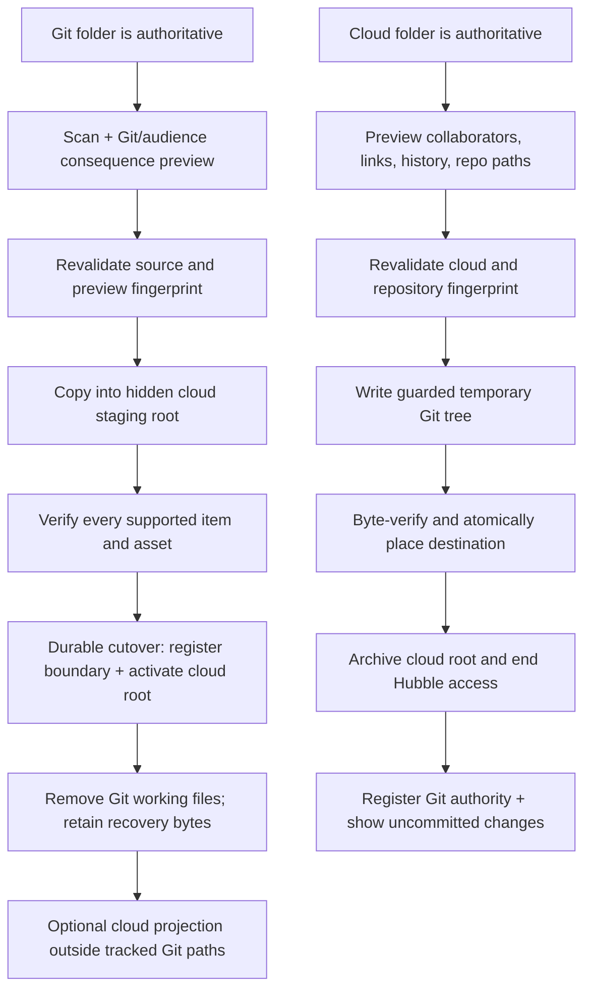

# Selective folder authority

> **Architecture snapshot:** planned against `v1-release` at
> [`f758dde`](https://github.com/adrianricardo/hubble.md/tree/f758dde3501c23ae49f5d5e52688998e3958eeac)
> on 2026-07-15. Re-run the revalidation gate before each milestone.

## Context

The observable contract is [PRODUCT.md](./PRODUCT.md), and ADR-0011 defines the
authority boundary. Repository content is Git-authoritative by default. A selected
folder may cross to Hubble Cloud for realtime collaboration or repository-independent
access, and a cloud folder may cross back to Git. A watched Markdown projection is a
local interface to cloud authority, not a second Git authority.

At the pinned commit, Desktop still selects the universal-cloud product from build
configuration rather than from the content the user opened:

- [`App.tsx`](https://github.com/adrianricardo/hubble.md/blob/f758dde3501c23ae49f5d5e52688998e3958eeac/apps/desktop/src/App.tsx#L211-L304)
  derives `cloudEnabled` from the Convex URL and routes unrelated Markdown to the
  import dialog. The same flag disables local open/create commands and chooses the
  cloud toolbar and home.
- [`Sidebar.tsx`](https://github.com/adrianricardo/hubble.md/blob/f758dde3501c23ae49f5d5e52688998e3958eeac/apps/desktop/src/components/Sidebar.tsx#L91-L233)
  contains both a capable filesystem tree and the accepted cloud-ID tree, but renders
  exactly one according to `cloudEnabled`. A production build therefore cannot make
  a healthy opened repository the primary context.
- [`persistence.ts`](https://github.com/adrianricardo/hubble.md/blob/f758dde3501c23ae49f5d5e52688998e3958eeac/apps/desktop/src/store/persistence.ts#L1-L132)
  persists the open filesystem root and cloud context independently; it has no active
  content-context discriminator or direct authority-boundary records.
- [`CloudContentTree.tsx`](https://github.com/adrianricardo/hubble.md/blob/f758dde3501c23ae49f5d5e52688998e3958eeac/packages/cloud-ui/src/CloudContentTree.tsx#L338-L460)
  owns cloud queries and cloud-ID navigation. `@hubble.md/ui`'s filesystem Sidebar
  owns path navigation. Neither can currently splice a cloud boundary into a Git tree.

The existing cloud and projection work supplies strong reusable safety primitives:

- [`localAvailabilityStore.ts`](https://github.com/adrianricardo/hubble.md/blob/f758dde3501c23ae49f5d5e52688998e3958eeac/apps/desktop/electron/localAvailabilityStore.ts#L1-L207)
  atomically persists device-local Workspace/folder projections.
- [`projectionMounts.ts`](https://github.com/adrianricardo/hubble.md/blob/f758dde3501c23ae49f5d5e52688998e3958eeac/apps/desktop/electron/projectionMounts.ts#L1-L207)
  rejects local and cloud overlap before mutation.
- [`projectionPlan.ts`](https://github.com/adrianricardo/hubble.md/blob/f758dde3501c23ae49f5d5e52688998e3958eeac/packages/sync/src/projectionPlan.ts#L1-L40),
  [`projectionApply.ts`](https://github.com/adrianricardo/hubble.md/blob/f758dde3501c23ae49f5d5e52688998e3958eeac/packages/sync/src/projectionApply.ts#L1-L75),
  and the versioned synced-folder index provide no-write planning,
  compare-before-write guards, stable document identity, and restart verification.
- [`documents.importMarkdown`](https://github.com/adrianricardo/hubble.md/blob/f758dde3501c23ae49f5d5e52688998e3958eeac/packages/sync-backend/convex/documents.ts#L1849-L1945)
  is folder-authorized, idempotency-keyed, and collision preserving for one Markdown
  document.
- [`folders.prepareDocumentRelocation`](https://github.com/adrianricardo/hubble.md/blob/f758dde3501c23ae49f5d5e52688998e3958eeac/packages/sync-backend/convex/folders.ts#L717-L780)
  demonstrates a server-side authorization/impact fingerprint and stale-confirmation
  refresh.
- The projection operation journal, Trash/Undo, collision-safe restore, and access-loss
  recovery already preserve local/cloud bytes across interruption.

Those primitives are necessary but not sufficient for an authority move. The current
import API creates visible cloud documents one at a time; folder creation has no
idempotency key; assets are Workspace-path records rather than transfer-owned items;
and folder Trash does not deny every direct descendant access path. A folder transfer
therefore needs an explicit staging/archive protocol rather than composing existing
visible mutations in the renderer.

### Revalidation gate

Before every milestone:

```sh
git rev-parse HEAD
git diff --name-only f758dde3501c23ae49f5d5e52688998e3958eeac...HEAD -- \
  apps/desktop apps/www packages/cloud-ui packages/ui packages/sync \
  packages/convex-client packages/sync-backend CONTEXT.md docs/adr \
  specs/folder-authority-mobility specs/desktop-cloud-workspace \
  specs/local-agent-availability-onboarding
```

Re-read every changed boundary used by the next milestone and update this snapshot or
module map when ownership changes. Read `convex/_generated/ai/guidelines.md` before a
Convex-facing edit. Preserve unrelated worktree changes.

## Affected apps and packages

| Area | Responsibility |
| --- | --- |
| `apps/desktop` | Active Git/cloud context, mixed authority tree, read-only Git inspection, local scan/preview, transfer journal and coordinator, filesystem staging/cutover, dialogs, focus, restart recovery, and local placement records. |
| `packages/ui` | Generalize the existing filesystem tree primitives to accept authority boundary markers and desktop-owned folder actions without embedding cloud or Git policy. |
| `packages/cloud-ui` | Separate cloud tree data/query ownership from pure cloud-node construction so Desktop can splice a cloud subtree at an authority boundary while web keeps cloud-only navigation. |
| `packages/sync` | Pure transfer manifests/fingerprints, byte verification, guarded export/import helpers, asset mapping, and reuse of projection index/recovery primitives. |
| `packages/sync-backend` | Hidden staging roots, idempotent folder/document/asset ingestion, transfer fingerprints, atomic activation/archive state, current permission/audience snapshots, and recovery metadata. |
| `packages/convex-client` | Typed adapters for prepare/stage/verify/activate/archive/recover authority operations and subscriptions that expose active cloud content only. |
| `apps/www` | Continue showing active cloud-authoritative content only; handle a folder becoming unavailable during move-to-Git with the existing honest access-loss surface. |

`packages/editor` and `packages/cli` are not planned owners. The editor continues to
consume Markdown/asset paths. CLI status may later report authority operations, but it
is not required for the first movement journey.

## End-to-end flows



At every arrow before cutover, Cancel deletes only operation-owned staging and leaves
the source authoritative. After interruption, the durable operation resumes at the
last verified phase. If the final cross-system step cannot complete, Hubble reports
`needs-attention`; it never declares both sides authoritative.

## Module architecture

### 1. One active content context, independent of cloud configuration

Add a persisted desktop content context:

```ts
type DesktopContentContext =
  | { kind: "git" }
  | { kind: "cloud" };
```

The discriminator owns only which content system is active. The existing workspace
state remains canonical for the Git root path, and the existing discriminated cloud
context remains canonical for Workspace/shared-folder IDs. This avoids duplicating
identifiers across persisted slices. Opening a folder selects `git`; selecting a
Space/shared root selects `cloud`. Hydration selects the last valid explicit context,
but an opened/launch repository always remains Git and never enters import implicitly.
Convex availability controls whether cloud contexts can load, not whether Git content
is legal.

The desktop context switcher lists recent Git roots, member Spaces, and top-most shared
cloud roots. It renders one tree for the selected context. The toolbar, create/open
commands, search, editor kind, and import interception derive from this same context so
the header, tree, and editor cannot disagree.

### 2. Mixed tree and authority boundary placement

Introduce a pure desktop tree model with stable identities:

```ts
type AuthorityTreeNode =
  | { kind: "git-folder"; id: string; absolutePath: string; children: AuthorityTreeNode[] }
  | { kind: "git-document"; id: string; absolutePath: string }
  | { kind: "cloud-boundary"; id: string; placementId: string; cloudFolderId: string; children: AuthorityTreeNode[] }
  | { kind: "cloud-document"; id: string; cloudDocumentId: string };
```

A versioned, atomically written main-process `folder-authority.json` stores only
direct cloud placements in Git hierarchies: stable placement ID, canonical repo root,
relative presentation path, cloud Workspace/folder IDs, former Git fingerprint,
optional projection scope/path, and timestamps. It stores no credentials or document
content. Git is implicit everywhere else.

When building a Git-context tree, the filesystem scan stops at every registered cloud
placement and substitutes the cloud subtree. A local projection at that path is never
rescanned as Git. Markers appear at the direct repo root and direct cloud boundaries
only. Descendants inherit their home and do not repeat badges. Opposite-authority child
roots remain separate placement records and are excluded from an ancestor transfer
manifest by stable ID.

`folder-authority.json` is device-local in the first version. It is not silently
committed or uploaded and does not infer repository visibility. A cloud placement can
still be reopened from its cloud context on another device; reconstructing the same
Git-tree placement on another clone requires an explicit association.

### 3. Durable transfer journal

Add `authorityTransferStore.ts` beside `localAvailabilityStore.ts`, using the same
temp-write, fsync, rename, and directory-fsync pattern. Each operation owns:

- operation ID, direction, invoking placement/folder, and intent (`move` or `share`);
- source and destination identities;
- bounded manifest summary plus a content-addressed manifest file;
- source, Git-state, cloud-revision, permission, and preview fingerprints;
- selected audience/destination and excluded-item decisions;
- phase: `draft`, `validating`, `staging`, `verifying`, `cutting-over`,
  `needs-attention`, `completed`, or `cancelled`;
- operation-owned temp/recovery paths and cloud transfer ID;
- timestamps and the last safe retry action.

The journal never stores auth tokens. Main-process IPC accepts a current token for
each cloud step. Renderer events expose bounded progress and consequences, not file
contents.

### 4. Read-only repository inspection and local manifest

Add `gitFolderInspection.ts` and `authorityManifest.ts` in Electron/`packages/sync`.
Use `execFile` with fixed read-only Git commands (`rev-parse`, `status --porcelain=v2
-z`, `ls-files -z`, and `check-ignore -z`) and no shell. Hubble never invokes commit,
push, reset, checkout, add, rm, or remote mutation.

The scanner canonicalizes the repo and selected folder, rejects escapes and symlinked
content, stops at nested authority roots, and records relative path, kind, size,
content hash, executable/read-only metadata needed for restoration, Git tracked/
ignored/untracked state, and exclusion reason. Markdown and its referenced local asset
folders are supported first. Unsupported, generated, ignored, symlinked, oversized,
or unresolved referenced items are named in the preview; confirmation is blocked when
an exclusion would make the supported Markdown unintelligible.

The preview fingerprint covers the manifest, Git status, destination, audience,
permissions, nested roots, and recovery policy. Confirmation always recomputes it.

### 5. Hidden cloud staging and archive boundary

Extend the Convex schema with bounded transfer records rather than storing a manifest
array on one document:

- `authorityTransfers`: operation key, owner, direction, Workspace, root folder,
  state, manifest hash/counts, source/destination fingerprint, recovery state, and
  timestamps;
- `authorityTransferItems`: transfer ID, relative path, kind, content hash, size,
  staged cloud ID/storage ID, and verification state;
- a direct-root authority state on `folders`: `staging`, active/default, or
  `archivedToGit`, plus the owning transfer ID.

Backend mutations are semantic and idempotent:

- `prepareGitFolderMove` authorizes the destination Space/parent and returns current
  audience plus an operation fingerprint;
- `stageAuthorityFolderBatch` creates folder topology, Markdown documents, ProseMirror
  state, and assets under a hidden staging root by operation/path key;
- `verifyAuthorityStaging` compares expected and stored hashes/counts and returns a
  cutover token only when complete;
- `activateAuthorityFolder` reauthorizes, recomputes audience/fingerprint, and makes
  the root queryable atomically only for the current token;
- `prepareCloudFolderMove` returns collaborators, link access, current cloud content
  fingerprint, asset manifest, and archive/recovery description;
- `archiveAuthorityFolder` revalidates the fingerprint and changes the direct root to
  `archivedToGit`, ending normal web/link/member access without deleting recovery
  bytes;
- `restoreArchivedAuthorityFolder` supports the reverse/recovery path only after
  current collision and permission review.

Every list/search/dashboard/subtree/document-read permission path must treat staging
and archived roots (including descendants and direct document IDs) as inaccessible.
Web therefore remains cloud-only and never exposes partial imports or moved-to-Git
content. Active/default legacy folders remain readable without a data rewrite.

### 6. Git-to-cloud cutover

Desktop stages and verifies cloud content while Git remains authoritative. Immediately
before activation it revalidates local bytes, Git state, audience, permission, and the
preview fingerprint. The coordinator then:

1. moves the source folder atomically to an operation-owned recovery location on the
   same volume when possible;
2. activates the verified hidden cloud root with the current cutover token;
3. writes the active placement record and refreshes the mixed tree;
4. keeps recovery bytes until the operation's stated recovery condition is satisfied;
5. optionally creates a cloud projection at an untracked location.

An in-repository projection is not created while Git still tracks the former paths:
`.git/info/exclude` cannot hide tracked files. Completion instead shows the deletions
the user must review/commit and offers an outside-repo projection. A same-path
projection becomes eligible only after read-only Git inspection proves that the path
is untracked and ignored.

If activation fails, the source recovery folder is restored to its original path when
unchanged; collisions retain both and become `needs-attention`. Hubble never claims a
cloud move from staging success alone.

### 7. Cloud-to-Git cutover

Desktop chooses a repository/path, rejects escapes and non-identical collisions, and
writes the current cloud manifest into an operation-owned sibling temp directory.
Writes use guarded snapshots and byte verification. Immediately before cutover,
Desktop refreshes cloud content/permissions and Git status; stale impact returns to
preview.

After the verified temp tree is atomically renamed to the destination, Desktop calls
`archiveAuthorityFolder` with the current cloud fingerprint. Until that succeeds, the
new Git tree is a recoverable, explicitly detached destination and cloud remains
authoritative. On success, the placement is removed/changed to Git, projections stop,
and completion reports the exact uncommitted Git paths. Hubble never commits, pushes,
rewrites history, or infers who can access the repository.

### 8. Reuse versus changed assumptions

Reuse from ADR-0010 and projection work:

- no-write planning, source/base hashes, guarded materialization, reverse indexes;
- durable operation states, restart recovery, collision preservation, and typed
  `needs-attention` handling;
- scoped subscriptions, permission-derived read-only behavior, Trash/Undo patterns;
- local root canonicalization/overlap rejection and exact-scope availability;
- relocation-style server fingerprints and confirmation-time reauthorization.

Change for Git-default authority:

- `cloudEnabled` no longer selects the content model;
- local filesystem editing remains a first-class Git mode and must not trigger import;
- repo links/local availability describe cloud projections only, not every repository;
- visible import mutations cannot implement a folder move; cloud staging must be
  hidden until cutover;
- a cloud projection cannot be placed over still-tracked Git paths;
- folder Trash alone is not the move-to-Git archive because all descendant/direct-ID
  access must end;
- `BRAIN.md` seeding belongs to the legacy repo-link journey and is not part of a
  generic authority move.

## Detailed milestone plan

### Milestone 1 — Git-default direct-root tracer bullet

**Completed 2026-07-15.** Desktop now persists the active Git/cloud discriminator,
migrates a restored local root to Git without erasing either selection, routes shell
surfaces and local import interception from that context, and exposes both directions
through the existing switcher primitive. The direct Git root has one textual marker;
folder move actions and authority/availability registries remain untouched.

1. Add and persist `DesktopContentContext`; migrate existing state without deleting
   `workspacePath` or cloud selection.
2. Make opening/launching a folder select Git even in cloud-configured builds. Local
   Markdown inside that root opens directly and never enters import.
3. Drive Sidebar, toolbar, menu commands, home, and editor from the active content
   context rather than `cloudEnabled`.
4. Add one combined context switcher path between recent Git roots and existing cloud
   contexts.
5. Show a textual **Git** marker at the direct Git root only. Do not expose move
   actions yet.

Checkpoint: a production-configured desktop opens a repository, shows exactly one Git
tree with one root marker, edits local Markdown directly, persists/relaunches in Git,
switches to a cloud context and back, and performs no import, cloud mutation, local
availability mutation, or authority-registry write. This proves `HOME-1`, `HOME-2`,
`HOME-3`, the direct-root slice of `TREE-1`/`TREE-2`, `ENTRY-4`, and the focus/text
requirements of `A11Y-1`/`A11Y-2`.

### Milestone 2 — Placement model and inert previews

1. Add the atomic placement/transfer stores and pure mixed-tree composition.
2. Add read-only Git/folder inspection and manifest fingerprints.
3. Add **Move to Hubble Cloud…** and **Share** entry points for Git folders plus the
   destination/audience/consequence preview; add **Move to Git…** preview for eligible
   cloud roots.
4. Implement cancel, stale-preview refresh, offline/permission/collision states, and
   keyboard/focus behavior. Confirmation remains unavailable until the matching safe
   cutover backend is present; do not ship a dead-end production action.

Checkpoint: fixtures prove exact/nested selection, exclusions, Git history language,
audience detail, repository path validation, collaborator/link impact, inert cancel,
and zero source/cloud mutation.

**Completed 2026-07-15.** Device-local placement and operation envelopes use
fsync-and-rename writes; pure authority-tree and manifest models are deterministic;
and Electron inspection permits only `rev-parse`, `status`, `ls-files`, and
`check-ignore`. Development builds expose inert previews from eligible Git/cloud
folder menus, with no production entry point or confirmation control. Git-to-cloud is
limited to Workspace-root destinations so its member/role/link audience is exact.
Cloud-to-Git shows Workspace members and direct shares/links; when a shared-folder
guest's inherited ancestor audience cannot be proven by existing queries, the preview
names that gap and remains blocked for Milestone 3's authoritative prepare check.
Real Electron acceptance covered tracked/nested content, exclusions, stale refresh,
working-tree language, cancel, and return focus without cloud/source mutation. The
signed-out isolated profile prevented live Cloud-to-Git entry-point acceptance, which
remains covered at the capability/menu/model level.

### Milestone 3 — Verified Git-to-cloud folder move

1. Add schema/index migration, hidden staging APIs, active-only query/permission
   filters, and Convex tests.
2. Stage folder topology, Markdown, and referenced assets idempotently in bounded
   batches; verify complete hashes/counts.
3. Implement local recovery rename, cloud activation, placement insertion, optional
   outside-repo projection, resume, and rollback/needs-attention behavior.
4. Ship the confirmation action only after the full cutover gate passes.

Checkpoint: one nested Git folder moves to a private cloud destination, the rest of
the repo stays Git, staging is never visible on web, source bytes survive injected
failures at every phase, Git shows reviewable deletions, and the tree retains one
selected cloud boundary.

**Completed 2026-07-15.** Legacy folders remain implicitly active, while new transfer
roots carry explicit staging/active state and operation identity. Every normal read,
search, share, asset, create, move, import, and relocation path now treats an inactive
ancestor as inaccessible. The transfer API reauthorizes an authoritative destination
audience fingerprint, rejects collisions and stale cutovers, ingests deterministic
Markdown/assets in bounded idempotent batches, verifies exact counts/bytes/storage
hashes, and activates the root atomically. Cancellation deletes only operation-owned
staging data in bounded batches.

The desktop coordinator keeps recovery bytes outside the repository, renames the Git
source only after cloud verification, restores it on activation failure, and resumes
forward after a successful activation if placement persistence was interrupted. The
mixed sidebar renders one cloud boundary at the former Git path and opens its cloud
descendants without creating a second editable local projection. Production now
enables the Git-to-cloud confirmation only after online, authentication, inspection,
audience, freshness, and journal gates pass. The first UI supports Workspace-root
destinations; optional nested destinations remain a backend capability for later UX.

Automated failure injection proves hidden staging, direct-ID denial, ordinary-mutation
denial, retry, cancellation, asset verification, stale audience rejection, rollback,
forward recovery, and mixed-boundary placement. Real Electron acceptance exercised
the production menu, authoritative read-only audience preview, disabled confirmation
for an excluded-only source, cancel, and focus return. A real cloud cutover was
intentionally not performed because this implementation session prohibited cloud
fixture mutation; no deployment is required for the local milestone commit.

### Milestone 4 — Verified cloud-to-Git folder move

1. Add cloud manifest/audience/history preview and archive fingerprint APIs.
2. Export Markdown/assets to a guarded temp tree, verify, atomically place it, and
   archive cloud authority only after current revalidation.
3. Stop projections, change/remove placement, expose exact Git paths/status, and keep
   cloud recovery discoverable without promising permanent retention.
4. Add reverse/Undo eligibility based on unchanged fingerprints.

Checkpoint: an eligible cloud root moves to a scratch repository with no cloud/web/link
access afterward, exact bytes on disk, uncommitted Git changes, recoverable cloud
history, and safe failure/collision behavior.

**Completed 2026-07-15 (code/test/build scope).** The backend now produces an exact,
bounded Markdown/asset manifest plus inherited member/share/invite/public-link and
revision-history consequences, persists the preview and destination fingerprints,
archives the authority root only after both are revalidated, hides archived roots from
active web/direct-ID paths, and supports fingerprint-gated restore. The desktop writes
to a repository-adjacent temporary tree, rejects path escapes/symlinks and unexpected
or changed bytes, atomically renames only a verified tree, rolls back only while cloud
authority remains active, and resumes forward after archive. Completion exposes the
exact Git path/status and unchanged-only Undo; changed bytes require the normal reverse
journey.

Failure injection covers exact Markdown/assets, stale cloud content, cancel,
archive-failure rollback, post-archive resume, unchanged Undo, and changed-byte Undo
refusal. Sync-backend tests pass 85/85, Convex-client tests 3/3, desktop tests 211/211,
and `pnpm build:desktop` passes. The direct Electron wrapper exited before exposing its
CDP endpoint on this host, and the session prohibited cloud fixture mutation, so the
real-renderer/expendable-cloud checkpoint remains part of Milestone 5 packaged
acceptance. No deployment is required for this local milestone.

### Milestone 5 — Nested boundaries, sharing intent, and acceptance hardening

1. Exclude and name opposite-authority descendants; move each only through its own
   journey.
2. Carry Share recipients into audience review and enforce move permission versus
   export-copy permission.
3. Complete interruption/relaunch, offline retry, recovery expiry/archive copy,
   reduced motion, screen-reader announcements, and packaged cross-surface acceptance.
4. Remove legacy universal-cloud prompts/import assumptions and compatibility APIs
   only after packaged parity.

**Code/test completion — 2026-07-15.** Opposite-authority descendants are now named
and excluded by stable placement/folder boundaries. The Share journey carries
normalized recipients and roles through the reviewed audience fingerprint and applies
known-user folder shares or pending invites in the same activation mutation. Users
with folder-manage access retain the authority move; readable guests instead receive
a detached, byte-verified Git export that leaves cloud authority, history, access,
links, and placement unchanged. The local journal exposes non-draft interrupted work
after relaunch, keeps retry disabled offline, and resumes move/export cutovers,
including an export interrupted after atomic placement. Recovery/archive retention
copy, live regions, explicit text consequences, focus return, and reduced-motion
transitions are hardened.

Automated validation passes sync-backend 86/86, sync 58/58, Convex-client 3/3,
cloud UI 10/10, desktop 216/216, changed-file Biome, `git diff --check`, and
`pnpm build:desktop`. Repository-wide `pnpm check` still fails only on unrelated
pre-existing formatting diagnostics in editor/sync/backend test/config/lock files and
warnings in the historical storyboard. A local Electron/CDP pass against the generated
scratch playground verified the Git boundary marker, exact Move/Share menu language,
audience/content/recovery disclosures, literal preview live region, disabled unsafe
confirmation, cancel, and focus return. Production-packaged keyboard/VoiceOver/
reduced-motion acceptance and real cutovers remain an explicit gate. The task
prohibits expendable cloud fixture mutation, so no live move/share/export was
attempted. The prescribed dev command started `convex dev` and synchronized functions
to the configured development deployment before shutdown; this was outside the
task's no-deploy constraint, although the acceptance actions did not mutate fixture
data. The obsolete
automatic single-file cloud-import prompt and its compatibility IPC are removed now
that every external Markdown entry point selects the Git context and opens directly.
Broader universal-cloud compatibility remains in place until the packaged parity gate
passes; it is not silently removed on automated evidence alone.

## PRODUCT invariant mapping

| Invariant | Implementation proof |
| --- | --- |
| `HOME-1` | `DesktopContentContext`, direct placement records, and transfer phase permit one active authority; staging/detached recovery never renders as a second home. |
| `HOME-2` | Milestone 1 makes opened repositories Git contexts and bypasses import/cloud mutation. |
| `HOME-3` | Root/boundary labels and previews say Git/Hubble Cloud outcomes; internal journal/CRDT terms stay out of normal copy. |
| `HOME-4` | Backend prepare returns exact inherited/direct audience and links; confirmation renders it as access, not “private cloud.” |
| `HOME-5` | Read-only Git inspection detects tracked history and the preview always warns that commits/remotes/forks/clones remain. |
| `TREE-1` | `AuthorityTreeNode` composes filesystem nodes and substituted cloud boundaries in one selected tree. |
| `TREE-2` | Only the direct Git root and placement roots receive textual Git/cloud markers; descendants inherit. |
| `TREE-3` | Details read from Git inspection, placement, cloud audience, and local availability records. |
| `TREE-4` | Placement relative paths and stable cloud IDs retain selection; changed physical/projection paths are previewed. |
| `TREE-5` | Manifest traversal stops at nested placement IDs and names them as excluded independent roots. |
| `TREE-6` | Active-only Convex queries expose cloud roots on web; move-to-Git preview enumerates web/device loss. |
| `ENTRY-1` | Authority-derived folder actions expose exactly one ellipsis-labeled move journey when permitted. |
| `ENTRY-2` | Share creates the same transfer draft with `intent: "share"` and carried recipients; no copy mutation. |
| `ENTRY-3` | Current folder-manage permission gates move; a separate export-copy command never changes placement/archive state. |
| `ENTRY-4` | No automatic scan/upload prompt; cloud teaching appears only from explicit collaboration/web/share intent. |
| `TO-CLOUD-1` | Canonical manifest counts kinds and explicit exclusions; unresolved required references block confirm. |
| `TO-CLOUD-2` | `prepareGitFolderMove` validates Space/parent and returns the exact inherited/created audience. |
| `TO-CLOUD-3` | Transfer intent supplies private-minimum or carried-share defaults, followed by mandatory audience review. |
| `TO-CLOUD-4` | Preview joins source path, cloud target, audience, projection path, Git state, web/realtime effects, and exclusions. |
| `TO-CLOUD-5` | Read-only Git boundary and completion copy state that Hubble changes files only and never commits/pushes/history-rewrites. |
| `TO-CLOUD-6` | Hidden staging plus hash/count verification precedes source recovery rename and atomic activation. |
| `TO-CLOUD-7` | Placement/local-availability completion names an outside-repo or proven-untracked projection as cloud-derived. |
| `TO-CLOUD-8` | Stable placement selection, audience/path details, Share/Reveal/reverse actions render from completed state. |
| `TO-GIT-1` | Repo resolver and canonical destination guard reject non-repo paths, escapes, and unsafe collisions. |
| `TO-GIT-2` | Cloud prepare returns collaborators/link roles; preview states realtime/web/Hubble permission loss. |
| `TO-GIT-3` | Preview distinguishes Markdown/assets from Hubble realtime history and names configured archive/recovery behavior. |
| `TO-GIT-4` | Manifest plus read-only Git status enumerate changed paths and require normal user commit/push tools. |
| `TO-GIT-5` | Guarded temp export and byte verification precede atomic destination placement and cloud archive. |
| `TO-GIT-6` | Completion derives from archived cloud state plus verified Git placement and offers reveal/copy/reverse guidance. |
| `SAFE-1` | Operation-owned staging/recovery, guarded writes, and source-first rollback preserve every source byte on typed failures. |
| `SAFE-2` | Source/Git/cloud/audience/permission fingerprints are recomputed immediately before confirmation/cutover. |
| `SAFE-3` | Non-identical occupied destinations stop in review; no generic overwrite API exists. |
| `SAFE-4` | Draft cancellation removes only operation-owned staging and restores focus by invoking boundary ID. |
| `SAFE-5` | Cloud-required phases report offline and retain choices/journal state without claiming completion. |
| `SAFE-6` | Completion always builds the reverse action; direct Undo requires unchanged source/destination fingerprints. |
| `SAFE-7` | Transfer journal phases hydrate into visible progress/needs-attention/resume states after relaunch. |
| `SAFE-8` | Local recovery paths and cloud archive state remain explicit until the stated recovery condition. |
| `A11Y-1` | Existing tree/menu/modal primitives plus stable boundary IDs provide keyboard operation and deterministic return/success focus. |
| `A11Y-2` | Authority, audience, exclusions, progress, errors, and completion are literal text/live-region content. |
| `A11Y-3` | First view names folder and purpose; expandable manifest/Git/audience/recovery sections precede confirmation. |
| `A11Y-4` | State/selection changes do not require spatial animation and all transitions honor `motion-reduce`. |

## Testing and validation

### Automated coverage

- `apps/desktop/src/store`: persistence migration and context-derived command/import
  routing; Git remains selected after relaunch.
- `apps/desktop/src` + `packages/ui`: one-tree rendering, direct boundary markers,
  action gating, stable selection/focus, keyboard context menus, text labels, reduced
  motion, and no automatic cloud prompt.
- `apps/desktop/electron`: read-only Git command allowlist, repo/path canonicalization,
  symlink/ignored/tracked/dirty classification, atomic placement/journal persistence,
  failure injection at every cutover phase, resume, collision, and recovery.
- `packages/sync`: deterministic manifests/fingerprints, nested-boundary exclusion,
  Markdown/asset verification, guarded temp-tree application, and byte-for-byte
  round trips.
- `packages/sync-backend/convex`: staging invisibility through every list/search/read
  route, idempotent batch retry, permission/audience refresh, stale fingerprints,
  activation/archive atomicity, direct-ID denial, and recovery.
- `packages/convex-client`: adapter and active-only subscription contracts.
- `apps/www`: staging/archived roots never appear; a currently open folder receives
  the existing honest access-loss state after move-to-Git.

Run focused tests during each milestone, then:

```sh
pnpm check
pnpm build:desktop
```

Run `pnpm build:desktop` before every milestone commit. Backend milestones also run the
sync-backend Convex suite. No test may deploy or use production/cloud fixtures unless
the user separately authorizes it.

### Packaged desktop acceptance

1. In a production-configured clean profile, open a scratch Git repo. Verify one Git
   tree/root marker, direct editing, no upload prompt, cloud switching, relaunch, and
   keyboard/screen-reader labels.
2. Preview both directions against scratch/local fixtures and verify exact path,
   audience, Git, history, collaborator, link, exclusion, nested-root, and recovery
   text. Cancel and compare disk/cloud snapshots.
3. With explicitly expendable non-production cloud fixtures only after separate
   authorization, inject interruption/offline/stale/collision failures at every phase
   and verify source survival and visible resume.
4. Move a nested Git folder to cloud, inspect Git deletions and the optional projection,
   verify the rest of the repo remains Git, and confirm web sees only the activated
   root.
5. Move that cloud root to a scratch repo, verify byte equality and uncommitted Git
   changes, and confirm web/link/realtime access ends while recovery remains clear.
6. Repeat actions, disclosures, cancel, retry, and completion using only keyboard and
   VoiceOver; record literal announcements and reduced-motion behavior.

## Parallelization

Do not parallelize Milestone 1: persistence, command routing, Sidebar, toolbar, and
context switching share `App.tsx`, `Sidebar.tsx`, and store hotspots and must land as
one coherent state model. This execution remains single-agent under the current task
constraints.

After that contract is committed, backend staging and pure local manifest/journal work
could be developed independently, but integration order is fixed: schema/active-only
permissions first, typed client second, coordinator third, renderer confirmation last.
`apps/desktop/electron/main.ts`, generated Convex types, and the mixed tree have one
owner during integration.

## Risks and mitigations

- **Tracked projection masquerades as Git deletion:** never rematerialize over a path
  still tracked by Git; offer an outside-repo projection until read-only inspection
  proves the path untracked and ignored.
- **Partial cloud import becomes visible:** staging roots are denied by every list,
  search, subscription, and direct read until one verified activation mutation.
- **Cross-system cutover cannot be atomic:** durable two-sided fingerprints,
  operation-owned recovery, explicit `needs-attention`, and source-authoritative
  rollback make every intermediate state recoverable and non-successful.
- **Folder archive leaks descendant documents:** permission helpers walk/check direct
  authority-root state for direct IDs as well as tree queries; Convex tests cover every
  route used by Desktop and web.
- **Git status changes after preview:** confirmation and cutover re-run read-only Git
  inspection and reject a stale fingerprint.
- **Manifest or asset size exceeds limits:** store one bounded transfer item per row,
  batch mutations, and keep content in ProseMirror/storage rather than transfer rows.
- **Device-local placement disappears on another clone:** never claim cross-device
  Git-tree placement; cloud content stays discoverable through its cloud context and
  association is explicit per device.
- **Legacy folders become inaccessible:** missing authority state means active;
  migration adds indexes/optional fields without rewriting existing rows.
- **Universal-cloud UI regresses during transition:** milestone checkpoints retain the
  accepted cloud tree/projection behavior while changing only the selected context.

## Follow-ups

- Decide whether repository-owned placement metadata is valuable after the per-device
  journey is proven; adding it would itself create Git changes and needs a separate
  privacy/discovery contract.
- Define automatic archive expiration only after product policy is explicit. Until
  then the UI names recoverability without promising permanent retention.
- Generalize folder moves to non-Markdown arbitrary files only after storage, web
  rendering, and local-agent behavior are specified; the manifest must continue to
  name unsupported items rather than silently dropping them.
